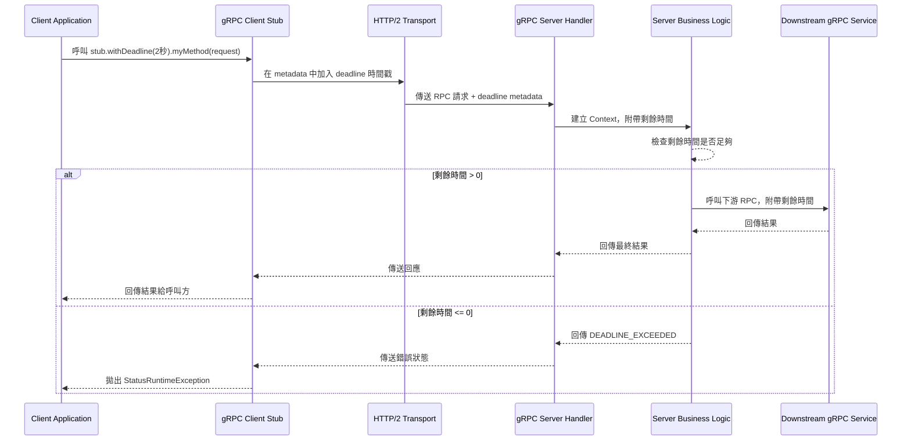

# **Java gRPC deadline 傳遞

**Client → Service A → Service B**

* Client 設定一個 deadline（例如 2 秒）
* Service A 收到後呼叫 Service B，並把 deadline 傳下去
* Service B 如果發現剩餘時間不足，就直接回 `DEADLINE_EXCEEDED`，不浪費資源





---

## 1. `service.proto`

```proto
syntax = "proto3";

package demo;

option java_multiple_files = true;
option java_package = "com.example.demo";
option java_outer_classname = "ServiceProto";

service ServiceA {
  rpc CallA(Request) returns (Response);
}

service ServiceB {
  rpc CallB(Request) returns (Response);
}

message Request {
  string message = 1;
}

message Response {
  string message = 1;
}
```

---

## 2. Service B (`ServiceBServer.java`)

```java
package com.example.demo;

import io.grpc.*;
import io.grpc.stub.StreamObserver;

import java.util.concurrent.TimeUnit;

public class ServiceBServer {

    static class ServiceBImpl extends ServiceBGrpc.ServiceBImplBase {
        @Override
        public void callB(Request request, StreamObserver<Response> responseObserver) {
            // 取得 deadline 剩餘時間
            long remainingMillis = Context.current().getDeadline().timeRemaining(TimeUnit.MILLISECONDS);
            System.out.println("[Service B] 剩餘時間: " + remainingMillis + " ms");

            if (remainingMillis < 500) {
                responseObserver.onError(
                    Status.DEADLINE_EXCEEDED
                        .withDescription("Not enough time to process request")
                        .asRuntimeException()
                );
                return;
            }

            try {
                Thread.sleep(300); // 模擬處理時間
            } catch (InterruptedException e) {
                e.printStackTrace();
            }

            Response response = Response.newBuilder()
                    .setMessage("[Service B] Processed: " + request.getMessage())
                    .build();
            responseObserver.onNext(response);
            responseObserver.onCompleted();
        }
    }

    public static void main(String[] args) throws Exception {
        Server server = ServerBuilder.forPort(50052)
                .addService(new ServiceBImpl())
                .build()
                .start();
        System.out.println("Service B listening on 50052");
        server.awaitTermination();
    }
}
```

---

## 3. Service A (`ServiceAServer.java`)

```java
package com.example.demo;

import io.grpc.*;
import io.grpc.stub.StreamObserver;

public class ServiceAServer {

    static class ServiceAImpl extends ServiceAGrpc.ServiceAImplBase {
        private final ServiceBGrpc.ServiceBBlockingStub serviceBStub;

        public ServiceAImpl(ServiceBGrpc.ServiceBBlockingStub stub) {
            this.serviceBStub = stub;
        }

        @Override
        public void callA(Request request, StreamObserver<Response> responseObserver) {
            System.out.println("[Service A] Received request, calling Service B...");

            try {
                Response fromB = serviceBStub
                        .withDeadline(Context.current().getDeadline()) // 將 deadline 傳遞給 B
                        .callB(request);

                Response response = Response.newBuilder()
                        .setMessage("[Service A] Got from B: " + fromB.getMessage())
                        .build();

                responseObserver.onNext(response);
                responseObserver.onCompleted();

            } catch (StatusRuntimeException e) {
                responseObserver.onError(e);
            }
        }
    }

    public static void main(String[] args) throws Exception {
        ManagedChannel channelB = ManagedChannelBuilder.forAddress("localhost", 50052)
                .usePlaintext()
                .build();

        ServiceBGrpc.ServiceBBlockingStub stubB = ServiceBGrpc.newBlockingStub(channelB);

        Server server = ServerBuilder.forPort(50051)
                .addService(new ServiceAImpl(stubB))
                .build()
                .start();

        System.out.println("Service A listening on 50051");
        server.awaitTermination();
    }
}
```

---

## 4. Client (`Client.java`)

```java
package com.example.demo;

import io.grpc.*;

import java.util.concurrent.TimeUnit;

public class Client {
    public static void main(String[] args) {
        ManagedChannel channelA = ManagedChannelBuilder.forAddress("localhost", 50051)
                .usePlaintext()
                .build();

        ServiceAGrpc.ServiceABlockingStub stubA = ServiceAGrpc.newBlockingStub(channelA);

        // 設定 deadline 2 秒
        Deadline deadline = Deadline.after(2, TimeUnit.SECONDS);

        try {
            Response res = stubA.withDeadline(deadline)
                    .callA(Request.newBuilder().setMessage("Hello!").build());
            System.out.println("Response: " + res.getMessage());
        } catch (StatusRuntimeException e) {
            System.err.println("Error: " + e.getStatus().getDescription());
        } finally {
            channelA.shutdown();
        }
    }
}
```

---

## 5. 執行步驟

```bash
# 生成 Java gRPC 代碼
protoc --java_out=src/main/java --grpc-java_out=src/main/java service.proto

# 先啟動 Service B
java com.example.demo.ServiceBServer
# 再啟動 Service A
java com.example.demo.ServiceAServer
# 最後啟動 Client
java com.example.demo.Client
```

---

## 6. 效果

* **如果 deadline 足夠**（例如 2 秒）：

  ```
  [Service B] 剩餘時間: 1700 ms
  Response: [Service A] Got from B: [Service B] Processed: Hello!
  ```
* **如果 deadline 太短**（例如 300ms）：

  ```
  [Service B] 剩餘時間: 200 ms
  Error: Not enough time to process request
  ```

這樣就可以清楚看到 deadline 是怎麼一路從 Client 傳到 Service A 再傳到 Service B，並且在 B 發現時間不足時直接拒絕處理，避免**連鎖故障**。

---


# withDeadline


對，`withDeadline(...)` 是 **Java gRPC SDK** 提供的方法之一，屬於 **Stub 的鏈式設定 API**。

---

## 1. 它在哪裡？

* 它定義在 gRPC Java 的 **`AbstractStub`** 類別裡
* 任何透過 `protoc` 生成的 **BlockingStub** / **FutureStub** / **AsyncStub** 都繼承自 `AbstractStub`，所以都有這個方法

---

## 2. 方法定義（簡化版）

```java
public S withDeadline(Deadline deadline) {
    return build(this.getChannel(), this.getCallOptions().withDeadline(deadline));
}
```

* `S` 代表具體的 Stub 類型（例如 `ServiceBGrpc.ServiceBBlockingStub`）
* `Deadline` 來自 `io.grpc.Deadline` 類別（可用 `Deadline.after(x, TimeUnit)` 建立）
* 會回傳一個 **新的 Stub 實例**（不可變設計，原來的 stub 不會被改變）

---

## 3. 作用

* 在該 Stub 呼叫的所有 RPC 上，**設定一個絕對截止時間**（absolute time）
* 這個 deadline 會在呼叫時透過 metadata 傳遞到下游服務
* 下游如果有實作 deadline propagation，就會根據剩餘時間決定要不要繼續處理

---

## 4. 相關方法

除了 `withDeadline`，還有：

* **`withDeadlineAfter(long duration, TimeUnit unit)`**
  直接設定「多久後超時」，比較常用
* **`withWaitForReady()`**
  即使伺服器暫時無法連線，也會等到 ready 再發送
* **`withCompression(String compressorName)`**
  設定壓縮方式（例如 gzip）

---

## 5. 範例

```java
ServiceBGrpc.ServiceBBlockingStub stubB = ServiceBGrpc.newBlockingStub(channel);

// 設定 2 秒 deadline
Deadline deadline = Deadline.after(2, TimeUnit.SECONDS);
Response res = stubB.withDeadline(deadline)
                    .callB(Request.newBuilder().setMessage("Hi").build());
```

這段會讓該次 RPC 呼叫在 **2 秒後自動中斷**，如果超過時間會拋出 `StatusRuntimeException`，狀態碼是 `DEADLINE_EXCEEDED`。

---


# what is stub
在 gRPC 的語境裡，**Stub** 就是客戶端用來呼叫遠端服務的「代理物件」（Proxy Object）。
它扮演 **本地方法呼叫** 和 **跨網路 RPC（Remote Procedure Call）** 之間的橋樑。

---

## 1. 為什麼要叫 Stub？

這個詞來自分散式系統與 RPC 的歷史，早在 Java RMI、CORBA、Thrift 裡就有：

* **Stub**（客戶端代理）負責把你的方法呼叫轉成網路訊息
* **Skeleton**（伺服端骨架）負責接收網路訊息並呼叫實際的伺服端方法
  （在 gRPC 裡，Skeleton 這個詞幾乎不用了）

你可以把它想成：

```
你呼叫 stub.method()
↓
stub 幫你序列化參數 → 傳到 server → 等結果 → 反序列化回物件
↓
你拿到好像是本地方法回傳的結果
```

---

## 2. 在 gRPC Java 中，Stub 的種類

gRPC 在編譯 `.proto` 檔時，會為每個 service 生成三種 **Stub**：

1. **Blocking Stub**（同步呼叫）

   ```java
   MyServiceGrpc.MyServiceBlockingStub blockingStub;
   Response resp = blockingStub.myMethod(request); // 呼叫會阻塞直到結果回來
   ```

2. **Future Stub**（回傳 `ListenableFuture`，可搭配 async 機制）

   ```java
   MyServiceGrpc.MyServiceFutureStub futureStub;
   ListenableFuture<Response> future = futureStub.myMethod(request);
   ```

3. **Async Stub**（非同步 callback）

   ```java
   MyServiceGrpc.MyServiceStub asyncStub;
   asyncStub.myMethod(request, new StreamObserver<Response>() {
       @Override
       public void onNext(Response value) { ... }
       @Override
       public void onError(Throwable t) { ... }
       @Override
       public void onCompleted() { ... }
   });
   ```

---

## 3. Stub 的行為

* **通訊細節自動處理**：序列化 / 反序列化、HTTP/2 傳輸、壓縮等
* **附加 RPC 設定**：

  * `withDeadline()` / `withDeadlineAfter()` 設定超時
  * `withCallCredentials()` 設定認證
  * `withCompression()` 設定壓縮
* **不可變設計**：每次呼叫設定方法會回傳一個新的 Stub，不會改變原來的 Stub

---

## 4. 小比喻

假設你打電話叫外送：

* **你** → 實際的呼叫方（客戶端）
* **外送平台客服** → Stub（它幫你處理下單流程、跟餐廳和外送員溝通）
* **餐廳廚房** → 伺服端真正的服務邏輯

你只跟 Stub 對話，不需要自己去跟餐廳談細節、處理交通、安排送餐。
